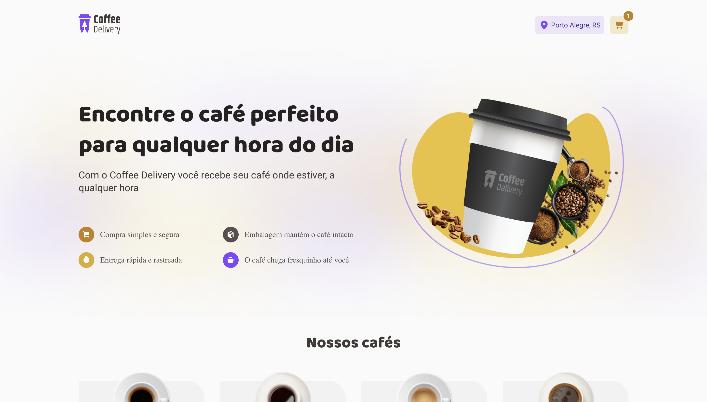
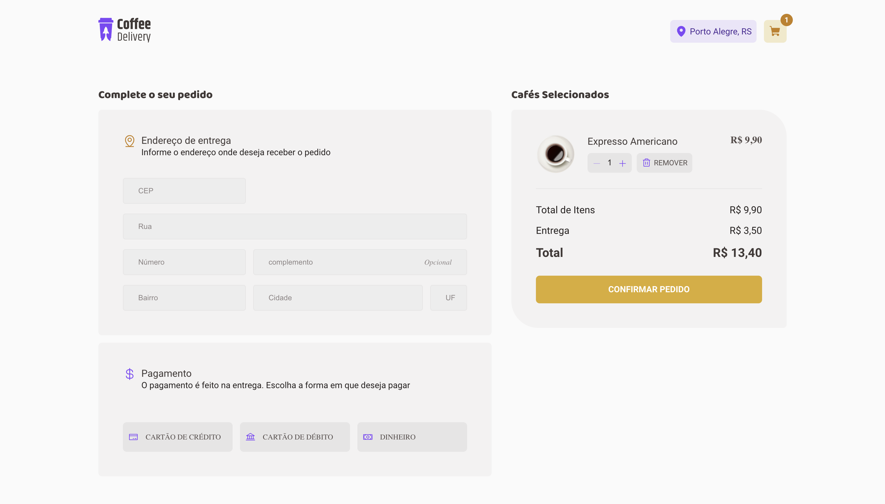

# 📸 Overview:



# 💻 Project:
Aplicação Frontend que simula uma loja de delivery de café onde é possivel adicionar e retirar itens no carrinho.

# 🚀 Technologies:
### ✔️ ReactJS 
### ✔️ React Hook Form
### ✔️ Styled-Components
### ✔️ TypeScript
### ✔️ Zod

# How to run

```
# Clone this repository
$ git clone https://github.com/vinnycosta9898/ignite-coffe-delivery

# Go to the directory
$ cd ignite-coffe-delivery

# Install Dependencies
$ npm install

# Run Web Server
$ npm run dev